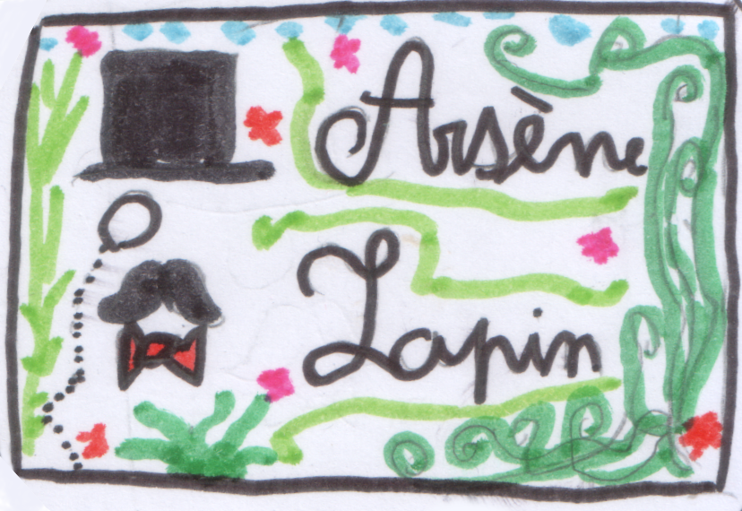
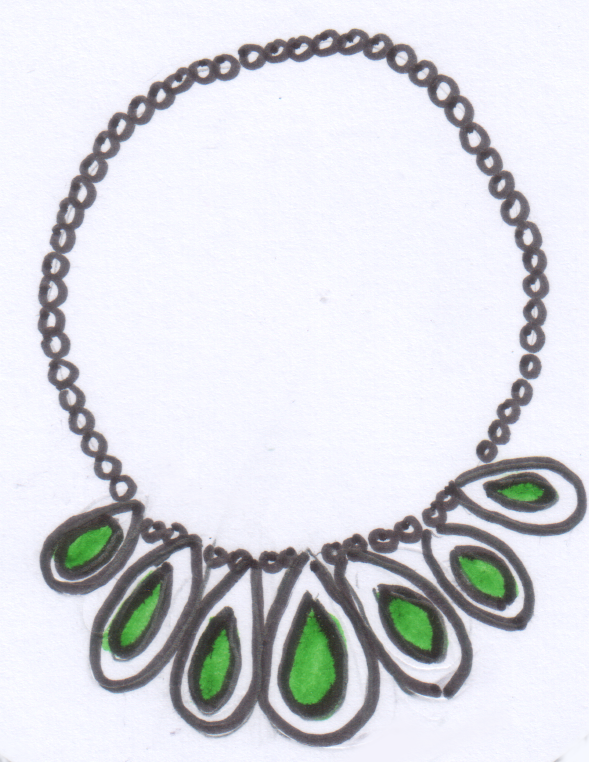
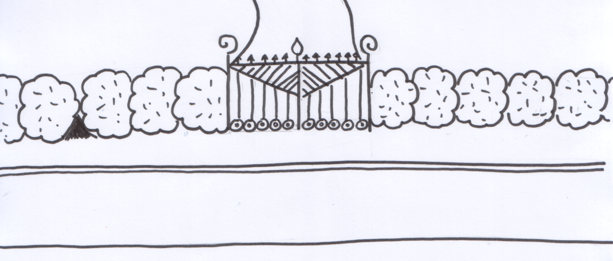
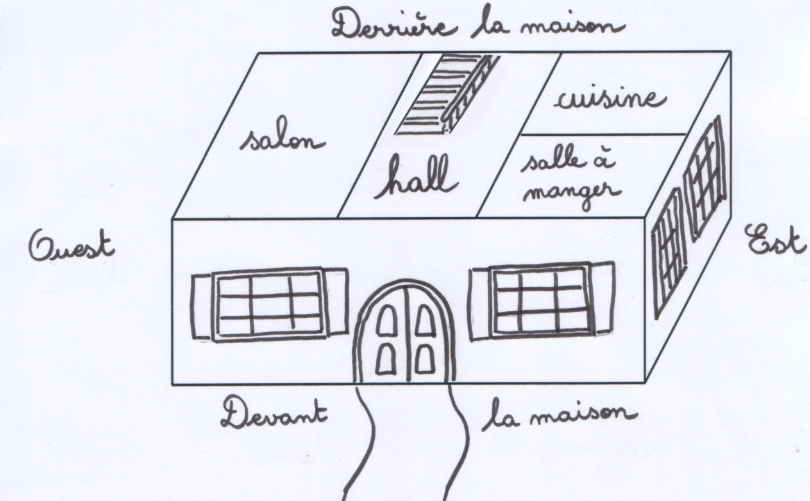
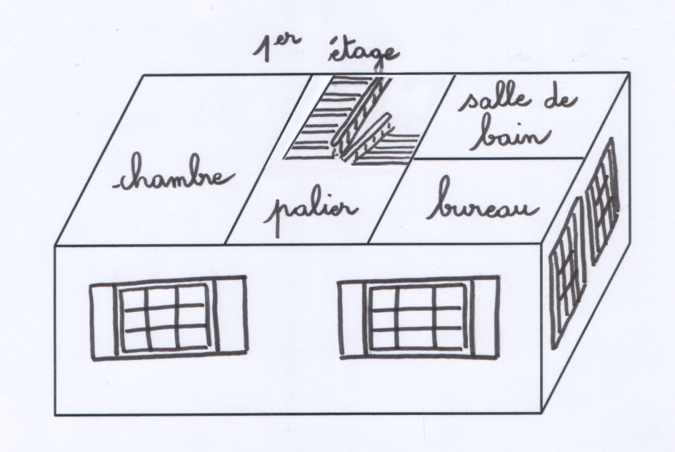
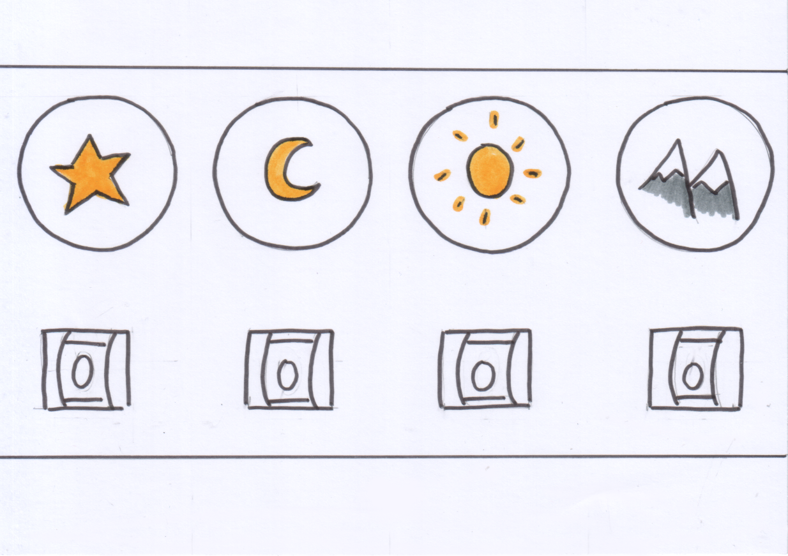
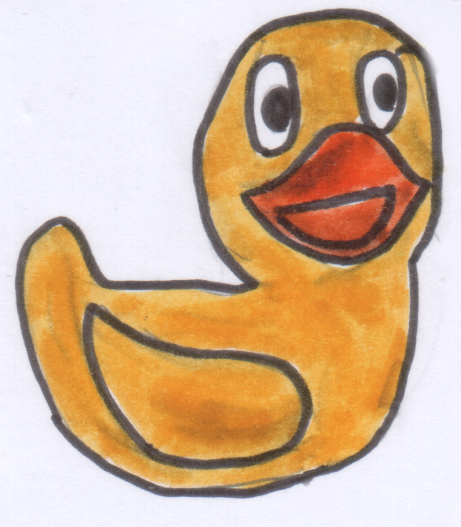
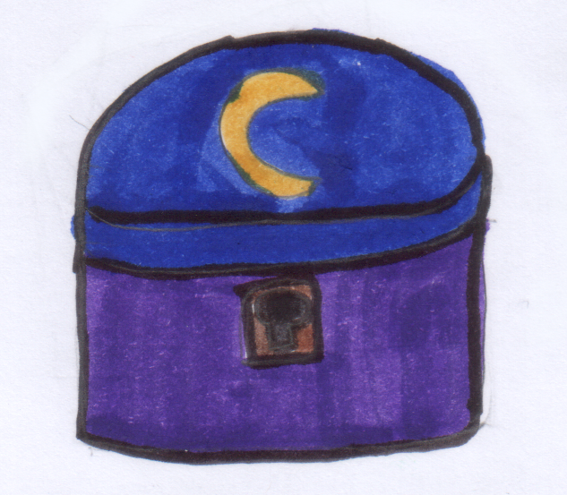

# Cambriolage en plein soleil

Scénario de jeu à la Zork ou Château aventure.

Par Alice C. (11 ans) et Marguerite T. (10 ans), supervisé par Stéphanie B.

Projet sous licence [Creative Commons BY-NC 4.0 FR](https://creativecommons.org/licenses/by-nc-sa/4.0/deed.fr) (en résumé : Attribution - Utilisation non commerciale - Partage dans les mêmes conditions).

Voir le fichier de [licence](licence.md).

## Remarques pour le maître du jeu

Tous les objets en __caractères gras__ peuvent être mis dans l'inventaire.

Conseillez aux joueurs de prendre des notes.

Demandez aux joueurs de formuler des commandes de type : « verbe à l'infinitif – complément – complément ».

Par exemple : _« donner une pièce au mendiant », « taper le troll avec le bâton »_.

## Inventaire de départ

- une carte de visite
- un article découpé dans le journal

### Actions possibles

#### Examiner carte de visite

Sur la carte de visite est écrit « Arsène Lapin »

#### Lire article de journal

C'est un article qui parle du Comte Aréglet, célèbre vendeur d'armes et de son magnifique collier d'émeraudes.

Il est précisé que le Comte est actuellement en vacances dans les Alpes.

## Solution

Le personnage de l'histoire, Arsène Lapin, doit s'emparer d'un collier d'émeraudes, enfermé dans un coffre fort. Des indices disséminés dans le manoir lui permettront de trouver la combinaison de celui-ci.

Le code pour ouvrir le coffre est : __4 – 3 – 6 – 9__

__Étoile 4__ : le nom REX 4 brodé sur la couverture étoilée du chien que l'on récupère en lui donnant le gigot à manger.

__Lune 3__ : la lune dessinée sur la boîte à musique et les 3 « tins » lorsque la boîte s'ouvre à l'aide de la clef trouvée sous le paillasson de l'entrée.

__Soleil 6__ : les 6 volumes de la biographie de Louis XIV, le roi Soleil (5 dans le bureau, 1 sur la table de chevet).

__Montagne 9__ : le message écrit à l'envers au dos de la photographie de vacances à la montagne et que l'on peut lire en le faisant se refléter dans le miroir de la salle de bain ; « le dernier chiffre est neuf ».

_Le personnage démarre l'aventure dans la rue._

## La rue

### Description

C'est l'été et le soleil tape fort. Vous êtes dans la rue. Devant vous se trouve une grille imposante à l'air solide. De chaque côté se trouvent de gros buissons épais et épineux. Un gros chat noir passe nonchalamment près de vous.

### Les sorties sont

- la grille (bloquée)

### Actions possibles

#### Examiner la grille

C'est une grille en fer, très haute, très solide et surtout fermée à clef.

#### Examiner le chat

C'est un gros chat noir bien nourri.

#### Caresser le chat

Le chat ronronne (__+ 1 prestige__).

#### Suivre le chat

Le chat avance tranquillement sans faire attention à vous et se dirige vers la haie.

## Trou dans la haie

### Description

En suivant le chat, vous apercevez un gros passage sous la haie.

### Les sorties sont

- le passage sous la haie
- la rue

### Actions possibles

#### Observer la haie

Le trou semble suffisamment large. Il y a quelques épines mais ça ne devrait pas faire trop mal.

## Le jardin

### Description

Après avoir épousseté votre costume et vérifié que vos plaies ne saignent plus, vous découvrez un magnifique jardin.
Il y a un chemin qui va de la grille à la porte d'entrée du manoir. Devant la porte se trouve un paillasson.

### Les sorties sont

- la porte d'entrée (bloquée)
- le passage sous la haie
- est
- ouest

### Actions possibles

#### Examiner la porte

C'est une jolie porte fermée.

#### Enfoncer la porte

La porte n'a pas eu mal mais vous oui !

#### Examiner le paillasson

Vous voyez écrit « GO AWAY »

#### Regarder sous le paillasson

Vous trouvez une __petite clef__.

#### Prendre petite clef

Vous avez désormais une petite clef dans votre inventaire.

#### Ouvrir porte avec clef

La clef est bien trop petite.

## Vers l'est

### Description

Vous voyez des fenêtres dont une seule est entrouverte au RDC.

### Les sorties sont

- devant la maison
- derrière la maison
- la fenêtre entrouverte

### Actions possibles

#### Examiner fenêtre

C'est une fenêtre ouverte.

#### Passer par la fenêtre

Vous entrez dans une cuisine.

## Vers l'ouest

### Description

Vous voyez une niche de grande taille.

### Les sorties sont

- derrière la maison (bloquée)
- le devant de la maison

### Actions possibles

#### Examiner la niche

Un bouledogue y dort. Sous sa patte, il y a une couverture.

#### Prendre la couverture chien là/Réveiller le chien

Le chien se réveille, il montre les crocs et bondit sur vous. Heureusement, il est attaché. Vous devez cependant reculer jusqu'au jardin devant la maison.

#### Donner le canard de bain au chien

Le chien tout content le prend dans sa gueule et vous entendez « pffff » et le canard se dégonfle. Vous n'aimeriez pas qu'il arrive la même chose à votre main. (- 1 prestige)

#### Donner le jambon au chien

Le chien accepte volontiers votre cadeau et va au fond de la niche pour le manger en ne s'occupant plus de la __couverture__.

#### Prendre la couverture chien parti

Vous avez une couverture dans votre inventaire.

#### Examiner la couverture

C'est une couverture à motif étoiles avec le nom Rex 4 brodé dessus.

## Derrière la maison

### Description

Vous êtes derrière la maison. Il y a un __tuyau d'arrosage__ et un parterre de fleurs qui ont l'air d'avoir chaud.

### Les sorties sont

- est
- ouest

### Actions possibles

#### Examiner le tuyau d'arrosage

C'est un __tuyau d'arrosage__ qui vient de Jardicity. Il est branché sur un robinet et prêt à fonctionner.

#### Allumer le tuyau d'arrosage

Vous arrosez les plantes avoisinantes qui en avaient bien besoin. Le comte vous sera reconnaissant de l'avoir fait à son retour. (__+1 prestige__)

#### Prendre le tuyau d'arrosage
Vous avez désormais un tuyau d'arrosage dans votre inventaire et c'est un peu encombrant.

## La cuisine

### Description

Vous arrivez dans une cuisine équipée avec tout ce qu'il faut pour faire de bons plats.

### Les sorties sont
- la fenêtre ouverte
- la salle à manger

### Actions possibles

#### Examiner la cuisine

Il y a un __jambon__ dans le frigo et un __couteau__ sur la table

#### Manger le jambon

Le jambon est froid mais délicieux, il en reste encore beaucoup.

#### Prendre le gigot / le couteau

Vous avez un du __jambon__ et un __couteau__ dans votre inventaire.

## La salle à manger

### Description

Il y a une grande table vide au centre de la pièce et un buffet sur le côté.

### Les sorties sont

- la cuisine
- le hall

### Actions possibles

#### Examiner le buffet

Il y a un cadre __photo__ posé sur le buffet.

#### Examiner la photo
Vous voyez le Comte souriant en vacances à la montagne. Vous remarquez que la __photo__ est de travers dans le cadre.

#### Sortir la photo du cadre

Au dos de la __photo__ il y a un message étrange, incompréhensible pour l'instant.

#### Prendre la photo
Vous avez à présent une __photographie__ avec un message incompréhensible écrit au dos dans votre inventaire.

## Le hall d'entrée

### Description

Vous voyez la porte d'entrée, un escalier qui mène au premier étage et une porte donnant sur le salon

### Les sorties sont

- la porte d'entrée (bloquée)
- le 1er étage
- le salon
- la salle à manger

### Actions possibles

#### Examiner le hall

Vous voyez la porte d'entrée, un escalier qui mène au premier étage et une porte donnant sur le salon

#### Ouvrir la porte d'entrée

La porte est fermée.

## Le salon

### Description

C'est une belle salle de vie avec un __poster__ impressionnant du Château de Versailles.

### Les sorties sont

- le hall

### Actions possibles

#### Examiner le poster

Il est punaisé au mur. C'est le type de __poster__ que l'on peut acheter dans la boutique souvenirs du château de Versailles.

#### Prendre le poster

Vous avez un __poster__ du château de Versailles et __4 punaises__.

## Le palier du 1er étage

### Description

Vous êtes sur le palier du 1er étage. Un grand tableau attire votre attention. Il représente le comte en cosplay  de Louis XIV.

### Les sorties sont

- le RDC
- la chambre
- la salle de bain
- le bureau
- le grenier

### Actions possibles

#### Examiner le tableau

C'est une peinture un peu ridicule qui représente le Comte habillé en Louis XIV. Vous apercevez 2 charnières sur le côté gauche du tableau.

#### Faire pivoter le tableau

Derrière le tableau, il y a un coffre-fort dernier cri fermé.

#### Examiner le coffre-fort dernier cri

Vous connaissez ce type de coffre. Il se bloque au bout de 10 mauvaises combinaisons.

Vous voyez 4 symboles dans l'ordre suivant :

étoile – lune – soleil - montagne

En dessous de chaque symbole, il y a une roulette avec des chiffres gravés dessus allant de 0 à 9.

#### Entrer le code 4 – 3 – 6 – 9

Le coffre fort s'ouvre. Il y a le __collier d'émeraudes__. Que faites vous ?

#### Entrer un autre code que 4 - 3 - 6 - 9

Rien ne se passe. Il vous reste X possibilités.

#### Prendre le collier

Vous avez le __collier__ dans votre inventaire. Que faites vous ?

#### Laisser la carte de visite « Arsène Lapin »

Vous signez votre vol en mettant votre carte de visite dans le coffre (__+1 prestige__) et vous disparaissez discrètement comme vous savez si bien le faire. __FIN__

## La chambre

### Description

Dans la chambre il y a un lit, une armoire et une table de chevet.

### Les sorties sont

- le palier

### Actions possibles

#### Examiner le lit

Rien d'intéressant…

#### Examiner l'armoire

Il y a des pyjamas en soie et un costume de Louis XIV.

#### Enfiler le costume de Louis XIV / pyjamas

Avec la perruque, vous allez avoir bien trop chaud et puis ce n'est pas votre taille.

#### Examiner la table de chevet

Il y a le tome 3 de d'une biographie de Louis XIV « Louis XIV, la vie de château »

## Le bureau

### Description

C'est la pièce où le Comte travaille. Il y a un bureau et une bibliothèque.

### Les sorties sont

- le palier

### Actions possibles

#### Examiner le bureau

Rien n'est posé dessus et les tiroirs sont fermés à clef

#### Examiner la bibliothèque

Il y a beaucoup de livres sur les armes et des biographies: Charlemagne (2 livres), Napoléon (10 livres), Louis XIV (5 livres) et Clovis (9 livres).

#### Lire le titre des biographies

- « Charlemagne, sa vie, son œuvre et son importance dans l'histoire contemporaine »
- « Napoléon, une enfance difficile »
- « Louis XIV, la vie de château »
- « Clovis, l'affaire du vase »

## La salle de bain

### Description

C'est une salle de bain rustique avec une baignoire, un lavabo et un miroir accroché au-dessus.

### Les sorties sont

- le palier

### Actions possibles

#### Examiner baignoire

Il y a un __canard de bain en plastique__.

#### Utiliser miroir sur message codé

Vous parvenez à décoder le message. Il est écrit :  « Le dernier chiffre est neuf ».

Il n'y a rien d'autre d'intéressant dans la salle de bain.

## Le grenier

### Description

Il y a beaucoup de bric à brac dans ce grenier. Tout est sale et poussiéreux sauf une __boîte__ qui bizarrement brille.

### Les sorties sont

- le palier

### Actions possibles

#### Examiner bric à brac

C'est poussiéreux, ça fait tousser.

#### Examiner boîte qui brille

Il y a une lune dessinée sur le couvercle de la __boîte__. Ça ressemble à __une boîte à musique__. Elle est fermée à clef.

#### Ouvrir boîte à musique avec un couteau

Vous vous entaillez le doigt. Votre état de santé passe à blessure légère.

#### Ouvrir boîte à musique avec la petite clef du paillasson

La boîte s'ouvre, vous voyez une danseuse qui tourne et vous entendez : « tin - tin - tin ».

## Score sur 10

__5 points si le collier est volé.__

### Points prestiges

- caresser le chat (+1)

- arroser les fleurs (+1)

- trouver la combinaison du premier coup (+ 2)

- trouver la combinaison en deux coups (+1)

- mettre sa carte de visite dans le coffre (+1)

### Points malus

- briser le miroir (-1)

- se blesser avec le couteau en essayant d'ouvrir la boîte à musique / les tiroirs du bureau (-1)

- donner le canard de bain au chien (-1)

- trouver la combinaison en plus de 5 coups (-1)

## Les objets à découper

[objets - page 1](images/cambriolage_en_plein_soleil-objets-01.png)

[objets - page 2](images/cambriolage_en_plein_soleil-objets-02.png)

[objets - page 3](images/cambriolage_en_plein_soleil-objets-03.png)

## Les plans à découper

[plan - page 1](images/plan01.png)

[plan - page 2](images/plan02.png)

